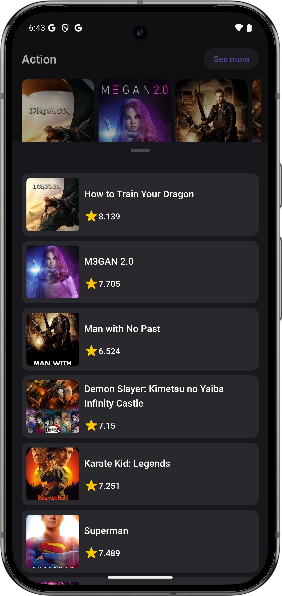
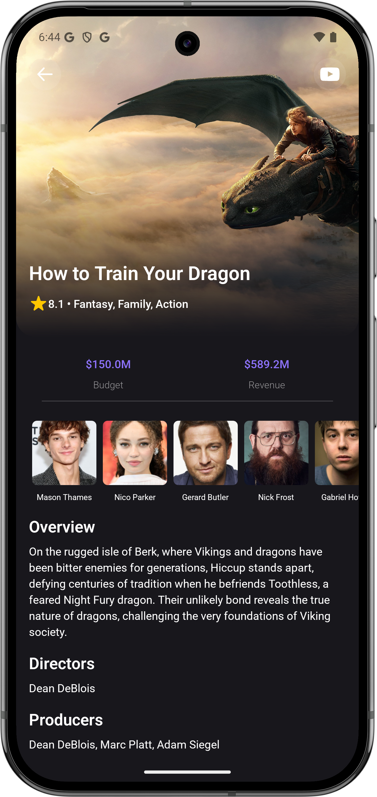

# Тестовое задание Lumo(Информация о фильмах).

## Содержание
- [Описание проекта](#описание-проекта)
- [Функциональность](#функциональность)
- [Архитектура и подход](#архитектура-и-подход)
- [Стек технологий](#стек-технологий)
- [Как запустить](#как-запустить)
- [Скриншоты](#скриншоты)


## Описание проекта
Приложение разработано в рамках тестовго задания для компании [JustMoby](https://justmoby.com/).
Реализован проект с функцией отображения списка фильмов, разбитого по категориям и более подробной информацией о каждом. 
Главная цель - продемонстрировать навыки работы с Kotlin, Views(XML), Coroutines, Retrofit, OkHttp и т.д.

## Функциональность
- Отображения списка разбитого по категориям
- Список фильмов по конктерной категории с пагинацией
- Отображение информации о конкретном фильме.

## Архитектура и подход
- MVI + Clean Architecture  
- Dependency Injection (Hilt)

## Стек технологий

| Область            | Технологии                         |
|--------------------|------------------------------------|
| Язык               | Kotlin                             |
| UI                 | View(XML)                          |
| Сеть               | Retrofit, OkHttp                   |
| DI                 | Hilt                               |
| Навигация          | Navigation Component               |
| Асинхронность      | Kotlin Coroutines + Flow           |

## Как запустить

### Для проверки работы приложение скачайте APK по кнопке ниже
[](https://github.com/muratov-yusuf/JustMobyTestProject/releases/download/JMTest/JMTest-0.0.1-debug.apk)
<p>Убедитесь, что в настройках телефона включена опция <strong>«Установка приложений из неизвестных источников»</strong>.</p>

### Чтобы запустить проект в Android Studio
1. Клонируйте репозиторий  
   ```bash
   git clone https://github.com/muratov-yusuf/JustMobyTestProject.git

2. Откройте проектв Android Studio.
3. Убедитесь, что в файле gradle.properties в полях *buildToolsVersion* и *ndkVersion* стоят версии, которые установлены на вашем ПК. Проверить версии можно в SDK Manager -> SDK Tools.
4. Создайте в корневой папке проекта файл secrets.properties и добавьте туда `TMDB_API_KEY="[ВАШ_API_КЛЮЧ]"`.
5. Запустите проект на устройстве или эмуляторе.

## Скриншоты
<div>
    
    
    
</div>

## Обратная связь
Буду рад фидбеку по архитектуре, UX и качеству кода.
Связь: work.yusuf.muratov@gmail.com • Telegram: @ymuratov
